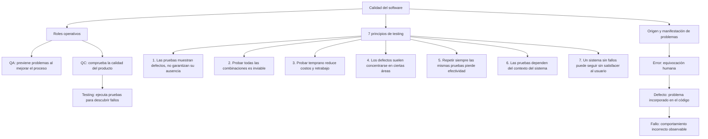

# Casos de prueba

## Mapa conceptual

## Diseño y resultados del plan de pruebas

Los resultados esperados fueron definidos antes de ejecutar el programa. Los casos aplican partición de equivalencia y análisis de valores límite, sin utilizar la estructura interna del código para seleccionar las entradas.

| ID | Descripción | Precondición | Entrada | Esperado | Real | Estado |
|---|---|---|---|---|---|---|
| CP-01 | Calcular un presupuesto con datos válidos de la partición normal | Programa iniciado y entradas numéricas válidas | Presupuesto: `1000`; socios: `4`; meses: `3` | Intereses: `$60.00`; total: `$1060.00`; cuota: `$265.00` | Intereses: `$180.00`; total: `$1180.00`; cuota: `$295.00`. Terminó con código `0`. | **Failed** |
| CP-02 | Comprobar el límite inferior de la cantidad de socios | Programa iniciado y presupuesto y meses válidos | Presupuesto: `1000`; socios: `0`; meses: `3` | Mensaje controlado indicando que debe existir al menos un socio; sin cierre inesperado | El programa se detuvo con `ZeroDivisionError: float division by zero` y código `1`. | **Failed** |
| CP-03 | Comprobar una duración fuera de la partición válida | Programa iniciado y presupuesto y socios válidos | Presupuesto: `1000`; socios: `4`; meses: `-1` | Mensaje controlado indicando que los meses no pueden ser negativos; no realizar el cálculo | Aceptó `-1` y mostró intereses: `$20.00`; total: `$1020.00`; cuota: `$255.00`. Terminó con código `0`. | **Failed** |

## Justificación de las técnicas

- **CP-01 - Partición de equivalencia válida:** representa entradas normales que deberían producir un cálculo correcto.
- **CP-02 - Valor límite:** utiliza `0`, frontera inmediatamente inferior al mínimo lógico de un socio.
- **CP-03 - Partición de equivalencia inválida y valor límite:** utiliza `-1`, valor inmediatamente inferior al mínimo lógico de cero meses.

## Evidencia de ejecución

- **Fecha de ejecución:** 11 de septiembre de 2026.
- **Entorno:** Python 3.12.14.
- **Archivo probado:** `presupuesto_analisis.py`, SHA de contenido `5b24e5c88d75187e3992f15b7e37c6db8274b756`.
- **Método:** una ejecución independiente por caso, introduciendo los tres valores en el orden presupuesto, socios y meses.
- **Integridad:** el archivo bajo prueba no fue modificado durante ni después de las ejecuciones.

## Reportes de fallos y defectos

### CP-01 - Cálculo incorrecto de intereses

- **Fallo observado:** con entradas válidas, el programa muestra `$180.00` de intereses en lugar de `$60.00`. Como consecuencia, también son incorrectos el total y la cuota.
- **Defecto localizado:** línea 9 de `presupuesto_analisis.py`.
- **Causa raíz:** la expresión utiliza `meses ** 2`, elevando los meses al cuadrado. Para un interés mensual simple, el presupuesto y la tasa deben multiplicarse por la cantidad de meses, no por su cuadrado.
- **Veredicto:** **Failed**.

### CP-02 - División entre cero no controlada

- **Fallo observado:** el programa se cierra inesperadamente y muestra `ZeroDivisionError: float division by zero`.
- **Defecto localizado:** línea 12 de `presupuesto_analisis.py`.
- **Causa raíz:** se ejecuta `total / socios` sin validar previamente que `socios` sea mayor que cero.
- **Veredicto:** **Failed**.

### CP-03 - Meses negativos aceptados

- **Fallo observado:** el programa acepta una duración de `-1` meses y presenta resultados como si la entrada fuera válida.
- **Defecto localizado:** defecto por omisión después de la línea 5; su efecto se manifiesta en el cálculo de la línea 9.
- **Causa raíz:** después de capturar `meses`, no existe una validación que rechace valores negativos. Además, el cuadrado aplicado en la línea 9 convierte `-1` en `1` y oculta el signo inválido.
- **Veredicto:** **Failed**.

## Resumen

| Total ejecutado | Passed | Failed |
|---:|---:|---:|
| 3 | 0 | 3 |

Los tres casos revelaron fallos. Esto no significa que todo el programa haya sido probado ni que no existan otros defectos; únicamente confirma los comportamientos observados para estas entradas.
