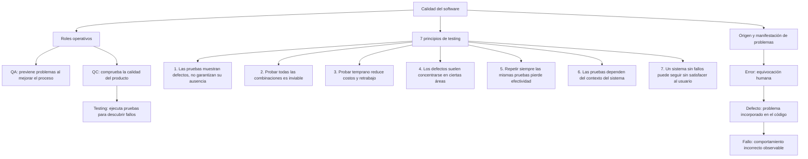

# Casos de prueba

## Mapa conceptual

## Diseño del plan de pruebas de caja negra

Los resultados esperados se definieron antes de ejecutar el programa. Los casos aplican partición de equivalencia y análisis de valores límite, sin utilizar la estructura interna del código para decidir las entradas.

| ID | Descripción | Precondición | Entrada | Esperado | Real | Estado |
|---|---|---|---|---|---|---|
| CP-01 | Calcular un presupuesto con datos válidos de la partición normal | Programa iniciado y entradas numéricas válidas | Presupuesto: `1000`; socios: `4`; meses: `3` | Intereses: `$60.00`; total: `$1060.00`; cuota por socio: `$265.00` |  |  |
| CP-02 | Comprobar el límite inferior de la cantidad de socios | Programa iniciado y presupuesto y meses válidos | Presupuesto: `1000`; socios: `0`; meses: `3` | Mensaje controlado que indique que debe existir al menos un socio; el programa no debe cerrarse inesperadamente |  |  |
| CP-03 | Comprobar una duración fuera de la partición válida | Programa iniciado y presupuesto y socios válidos | Presupuesto: `1000`; socios: `4`; meses: `-1` | Mensaje controlado que indique que los meses no pueden ser negativos; no se debe calcular el presupuesto |  |  |

## Justificación de las técnicas

- **CP-01 - Partición de equivalencia válida:** representa entradas normales que deberían producir un cálculo correcto.
- **CP-02 - Valor límite:** utiliza `0`, frontera inmediatamente inferior al mínimo lógico de un socio.
- **CP-03 - Partición de equivalencia inválida y valor límite:** utiliza `-1`, valor inmediatamente inferior al mínimo lógico de cero meses.

> **Estado de esta etapa:** casos diseñados. Las columnas **Real** y **Estado** permanecen vacías hasta realizar la ejecución dinámica de la Actividad 4.
